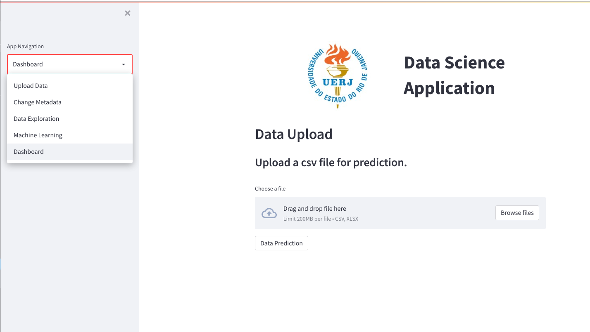

# Proposta
Criar uma aplicação web, na qual seja possível fazer upload de uma base de dados, tratamento dos dados, visualização dos dados, treino e teste de um modelo de Machine Learning. A linguagem de programação utilizada é Python, e a biblioteca para criação da página web é streamlit. Outras bibliotecas foram usadas como: 
- Pandas.
- Sklearn.
- Matplotlib.
- Seaborn.
- Plotly.

Essa aplicação contém 5 abas conforme a imagem abaixo:


### Data Upload
Responsável pelo upload da base de dados e um visão geral do dataset.

### Change Metadata
Permite alterar o tipo das colunas do DataFrame, remover dados nulos e remover linhas duplicadas.

### Data Exploration
Responsável pela exploração dos dados através de diversos gráficos.

### Machine Learning
Responsável pelo treinamento do modelo e visualização das métricas de treino e teste.

### Dashboard
“Paínel” cujo objetivo é fazer um upload de um base de dados e fazer a predição dos dados com base no modelo treinado na página “Machine Learning”.

# Objetivos
O objetivo da aplicação é facilitar as seguintes etapas:
- Tratamento dos dados.
- Visualização dos dados.
- Treinamento dos modelos.
- Predição dos dados.

# Limitações
As limitações são:
- Base de dados que tenha uma coluna que seja do tipo Timestamp.
- Lê uma base de dados por vez (tamanho limitado pelo Pandas).
- Três modelos de Machine Learning para treinamento.
- Execução local.

# Funcionamento
A base de dados utilizada foi obtida do Kaggle [1]. Poderia ser usada outros dados desde que tenha uma coluna do tipo Timestamp. Esta base de dado mostra o consumo de cerveja durante 365 dias em um bairro onde se localiza uma grande universidade. Os dados coletados além do consumo são: se o dia é fim de semana ou não, quantidade de milímetros de chuva, temperatura máximo, mínima e média. O objetivo da análise desses dados será usar um modelo de Machine Learning para prever o consumo de cerveja com base nas variáveis de entrada.

# Como executar o projeto
Após download de todos os arquivos, execute o arquivo principal do projeto pelo seguinte comando:
```
streamlit run app.py
```

Em seguida será exibido a página para fazer o upload do dataset. Faça o upload do datasete `data/consumo_cervejsa.csv`. A partir disso, será possível executar os passos seguintes da aplicação.


# Referências
[1] Beer consumption in São Paulo. Kaggle. Acesso: 12 de fevereiro de 2022. Disponível em: <https://www.kaggle.com/dongeorge/beer-consumption-sao-paulo>.

[2] Prakhar R, Manav P., Salil S.. Data Storyteller. Acesso: 12 de fevereiro de 2022. Disponível: <https://github.com/prakharrathi25/data-storyteller>.